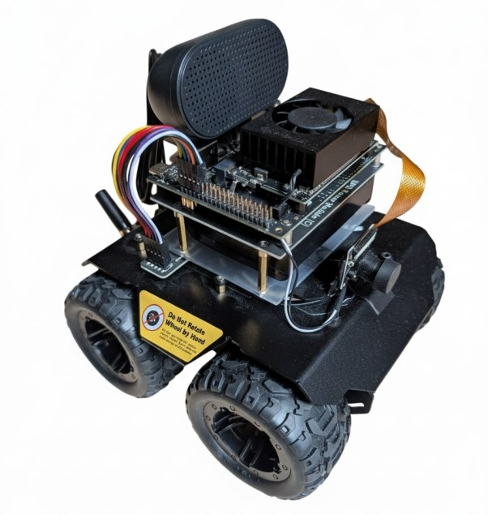

# Rover Assistant

<p align="center">
  
</p>

<p align="center"><em>A small robot that listens, looks, and drives — with everything running on-device.</em></p>

---

## What is it?

A voice- and vision-driven robot assistant that runs **entirely on a NVIDIA
Jetson Orin Nano 8 GB** — no cloud, no accounts, no data leaving your home
network. You talk to it, it talks back, and it drives around your living room
doing what you asked.

Talk to it like a person:

> **"Hey Rover — go to the red cup."**

and it will look around, spot the cup with its camera, drive over, and check
that it actually arrived before proudly announcing it. Ask **"what do you
see?"** and it will describe the scene in plain English. Say **"follow me"**
and it will tag along behind you.

## How it works

The robot runs two cooperating loops:

- **The fast loop (perception → action, ~10–30 Hz).** A camera thread keeps
  only the newest frame. YOLO11n (TensorRT) detects and tracks objects,
  computes each object's bearing, and a small rule-based selector turns that
  into wheel speeds through a motor HAL with a dead-man's watchdog. No neural
  network stands between "I see the cup" and "turn left" — this loop is
  deterministic and safe.
- **The slow loop (voice + reasoning, on demand).** The wake word
  (openWakeWord) opens a turn; Silero VAD and whisper.cpp turn your voice
  into text; simple commands ("stop", "turn left") are matched by regex and
  skip the model entirely. Everything else goes to **Gemma 4 E2B** — a small
  multimodal model served by llama-server — which answers questions about the
  camera view, plans missions as tool calls (`go_to`, `follow`, `describe`),
  and gives the final yes/no when the robot verifies it arrived.
- **Everything else.** A FastAPI server exposes the live camera feed with
  detection overlays, resource stats, and `/cmd` + `/stop` endpoints for
  debugging from a laptop. Piper speaks the replies sentence by sentence.

```
 you speak ──▶ wake word ──▶ VAD ──▶ STT ──▶ intents/planner ──▶ skills ──▶ wheels
                (openWakeWord) (Silero) (whisper.cpp)  (Gemma 4 E2B)   (deterministic)
                     ▲                                                       │
                     └──────────── "stop" regex bypasses everything ◀────────┘
```

**Safety first, by construction:** wheels stop if the brain hiccups for half
a second, speed is capped low by default, and the word "stop" is handled by a
regex *before any model runs*.

## Architecture in one picture

```
┌──────────────────── Jetson Orin Nano 8 GB (headless) ────────────────────┐
│                                                                          │
│  rover-brain (Python, asyncio, ONE CUDA context)                         │
│  ┌────────┐  ┌──────────────────┐ WorldState ┌──────────┐ skill ┌──────┐ │
│  │ Camera │─▶│ YOLO11n + track  │──────────▶ │ Selector │─────▶ │Skills│ │
│  │  HAL   │  │ bearing + colour │   (10 Hz)  │  rules   │       │ P-ctl│ │
│  └────────┘  └──────────────────┘            └────▲─────┘       └──┬───┘ │
│  ┌────────┐ 16k  ┌────────┐ ┌────┐ ┌─────┐ ┌─────┐│                ▼     │
│  │ Audio  │────▶ │ wake   │▶│VAD │▶│ STT │▶│intent│─┘  ┌──────────────┐  │
│  │  HAL   │      └────────┘ └────┘ └─────┘ └─────┘    │ Rover HAL    │  │
│  └────────┘                                           │ 20Hz watchdog│  │
│  Piper TTS ◀── say() ─────────────────────────┐       └──────┬───────┘  │
│                                               ▼              │ serial   │
│                       ┌──────────────────────┐        Wave Rover     │
│  FastAPI :8000        │ Planner (on demand)  │        ESP32 firmware │
│  /health /video /cmd  │ plan → act → verify  │                       │
│  /stop                └──────────┬───────────┘                       │
│                                  │ HTTP localhost:8080               │
│  rover-llama  llama-server — Gemma 4 E2B (vision + audio, GPU) ────────┘
└──────────────────────────────────────────────────────────────────────────┘
```

Deliberate design choices: **no ROS2** (one asyncio process instead of a
dozen nodes), **no depth model** (distance from object height in frame), and
**no per-frame image undistortion** (fix points, not pixels). The full design
— including the memory budget and why these choices matter — is in
[ARCHITECTURE.md](ARCHITECTURE.md).

## Hardware

| Part | Role |
|---|---|
| [Waveshare Wave Rover](https://www.waveshare.com/wave-rover.htm) | 4WD chassis with ESP32 motor firmware (JSON over serial) |
| NVIDIA Jetson Orin Nano 8 GB Super | The brain — setup notes in [docs/jetson_setup.md](docs/jetson_setup.md) |
| IMX219 CSI camera (160° FOV) | Vision; hardware-downscaled to 820×616 |
| USB microphone (16 kHz mono) | Voice input |
| USB speaker (48 kHz stereo) | Voice output |

Models shipped on-device (~6 GB total): Gemma 4 E2B Q4_K_M + mmproj,
whisper.cpp base.en, Piper lessac-medium, YOLO11n TensorRT FP16, and a custom
"Hey Rover" openWakeWord model. Exact filenames and SHA256s live in
[models/MODELS.md](models/MODELS.md).

## Repository layout

```
rover-assistant/
├── src/rover/        the brain: hal/ perception/ voice/ brain/ api/
├── config/           robot.yaml — every tunable in one file
├── bench/            measurement scripts (the numbers in STATUS.md come from here)
├── hardware_tests/   tests that need the real robot, run manually, wheels up
├── tests/            laptop-only pytest — must pass at every commit
├── scripts/          model downloads, llama.cpp build, YOLO export
├── deploy/           systemd units + install script
└── assets/           wake-word clips, UI sounds, test images
```

## Quick start (Jetson)

```bash
git clone https://github.com/ImanolGo/rover-assistant && cd rover-assistant
bash scripts/setup_pytorch_jetson.sh   # CUDA torch/tensorrt wheels
uv venv --system-site-packages && uv sync
bash scripts/build_llamacpp.sh         # builds llama-server (pinned commit)
bash scripts/download_models.sh        # Gemma, whisper, piper, YOLO — ~6 GB
bash scripts/export_yolo.sh            # TensorRT engine, built on-device
uv run rover                           # wheels up first!
```

A laptop works too: `ROVER_SIM=1 .venv/bin/rover` substitutes the camera, mic
and motors with fakes. (`uv run` is reserved for the Jetson — see STATUS.md
Known issue 9.)

### Two-machine workflow (edit on the laptop, test on the Jetson)

`origin` is GitHub and stays the source of truth. For the fast loop, push the
current branch straight into the Jetson checkout over SSH:

```bash
scripts/dev_sync.sh            # push current branch to the Jetson working tree
scripts/dev_sync.sh --test     # ...then run pytest there
```

One-time setup: `ssh jetson 'cd ~/repos/rover-assistant && git config
receive.denyCurrentBranch updateInstead'`, then `git remote add jetson
jetson:repos/rover-assistant`. Pushing is refused if the Jetson tree is dirty
(so committed bench output is never clobbered).

## Documentation

| File | Purpose |
|---|---|
| [STATUS.md](STATUS.md) | Live progress with measured numbers. Start here to see where we are. |
| [PLAN.md](PLAN.md) | The work order: phases, gates, exit criteria. |
| [ARCHITECTURE.md](ARCHITECTURE.md) | The full design, loop rates and memory budget. |
| [PORTING.md](PORTING.md) | Provenance map: which file came from where and why. |
| [docs/BENCHMARKS.md](docs/BENCHMARKS.md) | How every component is measured. |
| [docs/wave_rover_json_commands.md](docs/wave_rover_json_commands.md) | Motor firmware command reference. |
| [AGENTS.md](AGENTS.md) | Ground rules for coding agents working on this repo. |

## Status

Under active development — see [STATUS.md](STATUS.md) for the honest, current
state. The environment, models and measurement tooling are in place; component
benchmarks are being recorded now.

## License

Apache-2.0 — see [LICENSE](LICENSE).
